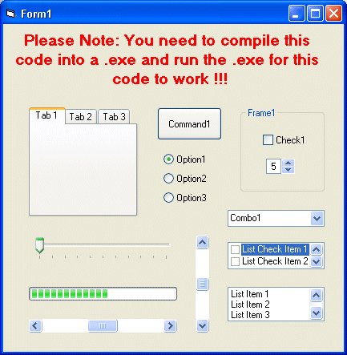



## XP Style Controls WORKING 100%

### Description

WORKS 100% - Use the Windows XP style look (buttons, frames, everything...) in your VB6 applications running on Windows XP. You simply add the module to your existing project. I've documented the project pretty well for someone who never does :) Note: It works best using the Microsoft Windows Common Controls 5.0 (SP 2) & Micorsoft Windows Common Controls-2 5.0 (SP 2) - It will take you 5secs to updates any existing program!!!
 
### More Info
 

             |
---                |---
**Submitted On**   |2003-08-17 18:12:02
**By**             |[David Sykes](https://github.com/Planet-Source-Code/PSCIndex/blob/master/ByAuthor/david-sykes.md)
**Level**          |Beginner
**User Rating**    |5.0 (15 globes from 3 users)
**Compatibility**  |VB 5\.0, VB 6\.0
**Category**       |[VB function enhancement](https://github.com/Planet-Source-Code/PSCIndex/blob/master/ByCategory/vb-function-enhancement__1-25.md)
**World**          |[Visual Basic](https://github.com/Planet-Source-Code/PSCIndex/blob/master/ByWorld/visual-basic.md)
**Archive File**   |[WORKING\_XP1631318172003\.zip](https://github.com/Planet-Source-Code/david-sykes-xp-style-controls-working-100__1-47782/archive/master.zip)

